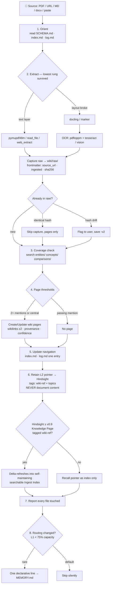

# agent-ingest-doc

A [Hermes Agent](https://github.com/NousResearch/hermes-agent) skill that ingests documents — PDF, URL, Markdown, .txt, .docx, pasted text — into a three-layer memory architecture:

- **L3 (LLM wiki)** — full content: immutable raw sources (sha256 + drift detection) + synthesized, cross-linked wiki pages
- **L2 (Hindsight)** — one episode *pointer* per ingest (never the content)
- **L1 (local MEMORY.md)** — only durable behavior-changing facts, guarded by a 75% capacity rule

Based on the [Karpathy LLM Wiki pattern](https://gist.github.com/karpathy/442a6bf555914893e9891c11519de94f) for the L3 layer. Verified against **Hindsight v0.9.1** (Aug 2026).

## Ingest flow



Query-time routing (dual-store, Pattern 3): known page → read the wiki directly (index-first, deterministic); temporal / entity-relational / personal question → `hindsight_recall` / `hindsight_reflect`; document pick → Knowledge Page search (`GET /knowledge-base/search`).

## Install

```bash
mkdir -p ~/.hermes/skills/research
git clone https://github.com/david6055my/agent-ingest-doc.git ~/.hermes/skills/research/doc-ingest
```

## Usage

Just ask your Hermes agent:
- "Ingest this PDF into the knowledge base"
- "Add this URL to the wiki"
- "Ingest these docs" (bulk mode)

The skill handles orientation, raw capture with frontmatter, page synthesis with
cross-links and contradiction handling, index/log navigation updates, the L2
Hindsight pointer retain, and reporting.

### Extraction ladder

Capture picks the **lowest rung the document survives** (verified against 2026
PDF-parsing benchmarks):

1. **Text layer** — `pymupdf4llm` for PDFs, `read_file` for .docx, `web_extract` for URLs. Free, milliseconds.
2. **Layout models** — `docling` (tables/multi-column) or `marker` (GPU speed) when rung 1 output is scrambled.
3. **OCR/vision** — `pdftoppm` + `tesseract`, or a vision model, for scans and photos.

### Helper script

`scripts/capture_raw.py` (stdlib-only) writes the raw file with `source_url` /
`ingested` / `sha256` frontmatter and detects re-ingest drift
(identical → skip; changed → flag + version bump):

```bash
python3 scripts/capture_raw.py --wiki ~/wiki --title "Doc Title" \
  --source-url https://example.com/doc < extracted.txt
```

## Workflow

1. **Orient** — read SCHEMA.md / index.md / log.md (prevents duplicates)
2. **Capture** — route by type (web_extract, PDF text-layer, OCR fallback, verbatim copy); sha256 frontmatter
3. **Check coverage** — search existing pages, apply page thresholds
4. **Write/update wiki pages** — wikilinks, provenance markers, confidence levels
5. **Update navigation** — index.md + append-only log.md
6. **Retain L2 pointer** — episode metadata via `hindsight_retain`, tagged `wiki-ref`
7. **Report** — every file created/updated

## How this maps to Hindsight (Aug 2026 research)

The "content to L3, pointer to L2" rule is Pattern 1 of four Hindsight × LLM Wiki integration patterns:

1. **Pointer retention** (this skill) — Hindsight's recall (semantic + BM25 + entity-graph + temporal, cross-encoder reranked) finds the pointer; the wiki holds the knowledge. Cheapest, cleanest separation.
2. **Wiki as Hindsight raw layer** — push wiki pages through Hindsight's documents API to gain temporal queries, entity multi-hop traversal, and automatic contradiction reconciliation. High-value corpora only.
3. **Dual-store query routing** — known page → read the wiki; temporal/personal/entity question → `hindsight_recall`/`reflect`.
4. **Knowledge Pages (Hindsight ≥ v0.9)** — the reverse projection: `hindsight fs mount` renders self-updating markdown pages built from consolidated observations. A page is a view over memory, not storage — it re-projects rather than rots. A companion to, not replacement for, the curated wiki. On v0.9.1 this also gives you a **self-maintaining ingest index**: a Knowledge Page tagged `wiki-ref` delta-refreshes from this skill's retained pointers into a searchable, document-level view of the ingest history (bridge pattern live-verified Aug 2026 — see SKILL.md Pattern 4 and `references/hindsight-knowledge-pages.md`).

See [SKILL.md](SKILL.md) § "L2 ↔ L3 integration patterns" for details and sources (Hindsight Knowledge Pages docs, arXiv:2512.12818, Karpathy's LLM Wiki gist).

## License

MIT
